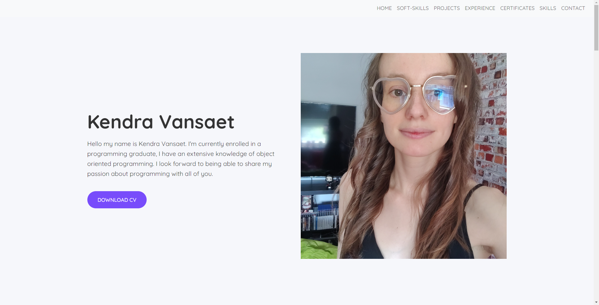
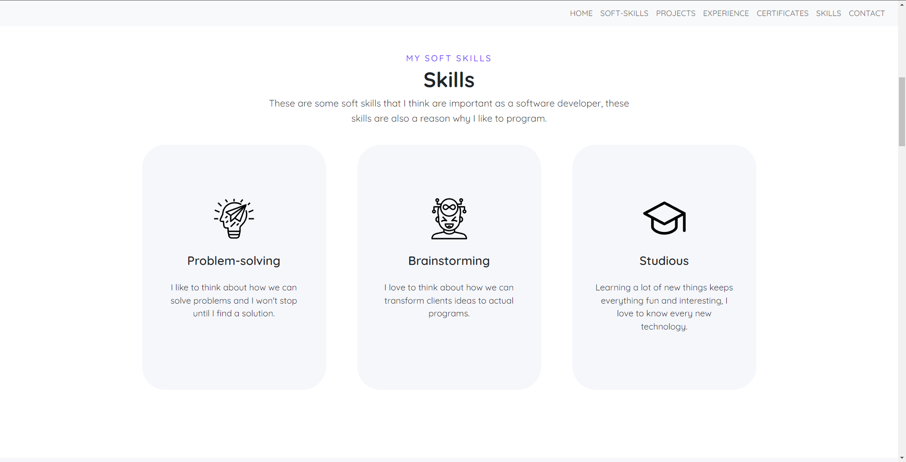
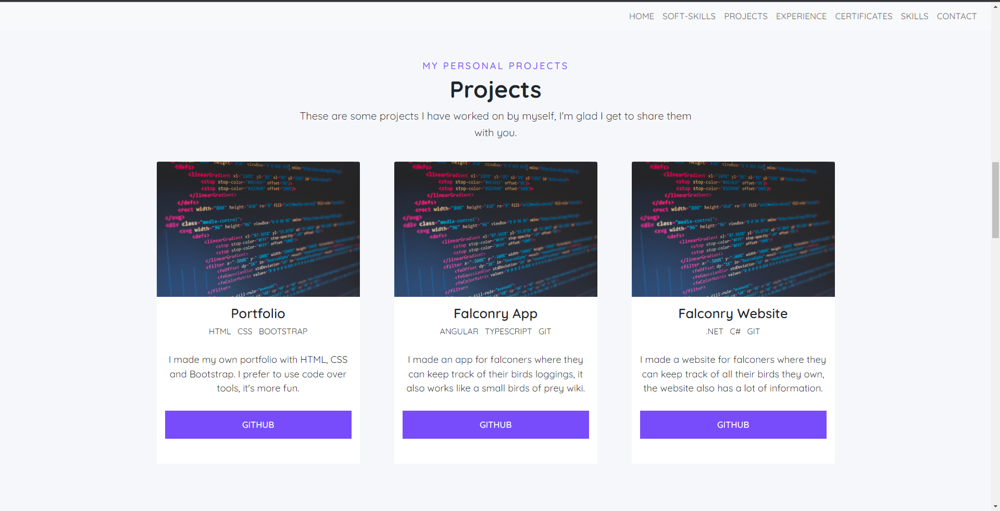
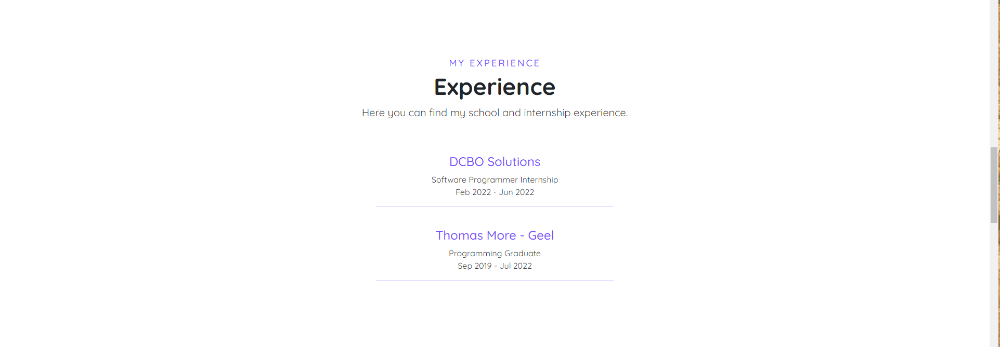
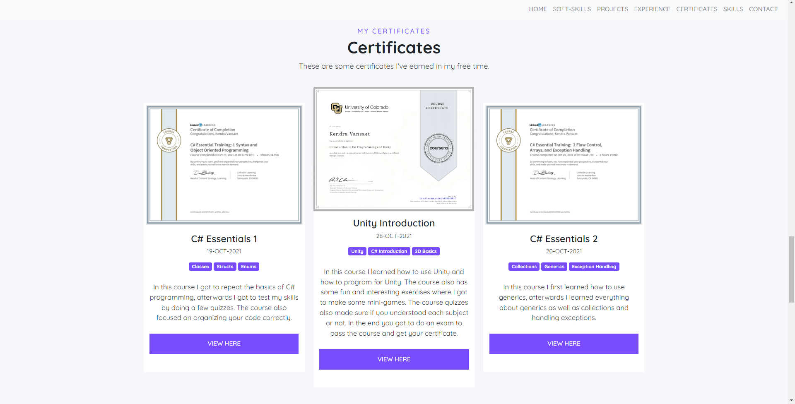
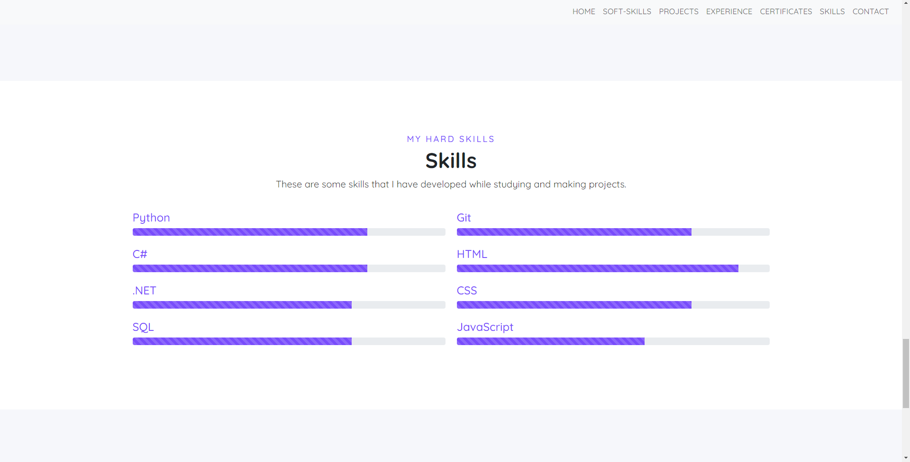
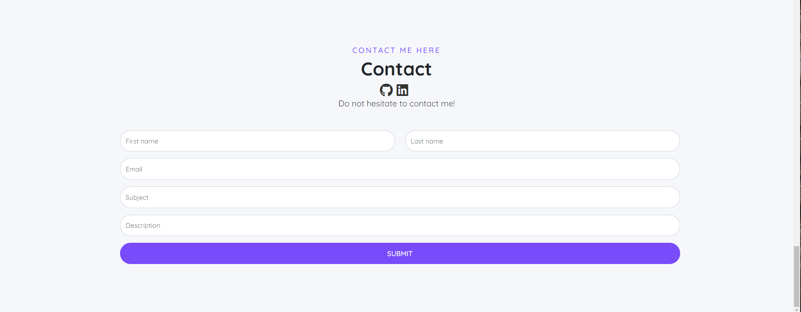

# Portfolio

## Table of Contents

- [Introduction](#introduction)
- [Features](#features)
- [Demo](#demo)
- [Pictures](#pictures)

 

# Introduction
I made this project during my last year of my programming graduate. The goal of this project is to highlight and showcase examples of my work, skills, achievements and accomplishments.

 

# Features

* Home
* Soft-skills
* Projects
* Experience
* Certificates
* Skills
* Contact
* Responsive

 

# Demo
* Watch my live [demo here](https://kendra.sinners.be/) 

 

# Pictures

HOME            
:-------------------------:
  

SOFT SKILLS            
:-------------------------:
  

PROJECTS            
:-------------------------:
  

EXPERIENCE            
:-------------------------:
  

CERTIFICATES            
:-------------------------:
  

SKILLS            
:-------------------------:
  

CONTACT            
:-------------------------:
  
